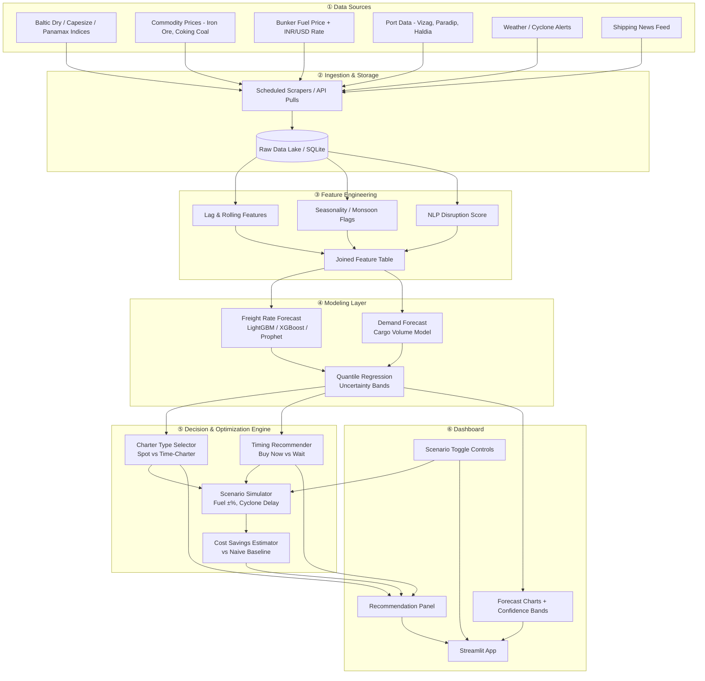

# 🚢 CargoCast

**Intelligent Freight Forecasting & Charter Optimization for Bulk Cargo Procurement**

Built for **SIH26006** — Ministry of Steel, Smart India Hackathon 2026

> Predicting freight rates, scoring shipping disruptions, and recommending optimal vessel chartering & procurement timing for bulk cargo (iron ore, coking coal) shipped to India's East Coast ports.

---

## 📌 Problem Statement

**SIH26006 — Development of an Intelligent Freight Forecasting Model for Optimized Vessel Chartering and Bulk Cargo Procurement from overseas to East Coast of India**

Steel plants procuring bulk raw materials (iron ore, coking coal) via overseas shipping face volatile freight rates, unpredictable disruptions (cyclones, port congestion, geopolitical events), and reactive, manual chartering decisions — leading to avoidable cost overruns.

CargoCast forecasts freight rates and cargo demand, scores real-time disruption risk from shipping news, and recommends data-backed charter/procurement decisions — with a live scenario simulator and quantified cost-savings estimate.

---

## ✨ Key Features

- 📈 **ML-based freight rate & demand forecasting** with confidence intervals (LightGBM / XGBoost / Prophet)
- 📰 **NLP-driven disruption scoring** from shipping news (strikes, cyclones, route delays)
- 🧭 **Explainable decision engine** — spot vs. time-charter selection, buy-now vs. wait timing
- 🎛️ **Live scenario simulator** — stress-test fuel price shocks, port delays, demand spikes
- 💰 **Quantified cost-savings estimator** — model strategy vs. naive baseline, in ₹
- 📊 **Interactive Streamlit dashboard** — forecasts, recommendations, and scenario controls in one view

---

## 🏗️ System Architecture



---

## 🧰 Tech Stack

| Layer | Tools |
|---|---|
| Language | Python |
| Forecasting | LightGBM, XGBoost, Prophet, scikit-learn |
| NLP | NLTK / VADER |
| Data Storage | SQLite, pandas |
| Decision Logic | Rule-based Python (explainable, no black box) |
| Dashboard | Streamlit, Plotly |
| Design Reference | Google Stitch (UI concept only) |
| Collaboration | GitHub, Google Colab |

---

## 📁 Repository Structure

```
cargocast/
├── data/
│   ├── raw/                     # raw scraped/downloaded data
│   └── processed/               # cleaned, consolidated dataset
├── features/
│   └── feature_engineering.py   # lag/rolling/seasonality → joined feature table
├── models/
│   ├── forecasting.py           # freight rate + demand forecast models
│   └── quantile_regression.py   # uncertainty bands
├── nlp/
│   └── disruption_scoring.py    # VADER-based shipping news scorer
├── decision_engine/
│   ├── charter_selector.py      # spot vs. time-charter logic
│   ├── timing_recommender.py    # buy-now vs. wait logic
│   └── scenario_simulator.py    # fuel/delay/demand shock simulation
├── backend/
│   └── pipeline.py              # integration layer — exposes clean functions to dashboard
├── dashboard/
│   └── app.py                   # Streamlit app
├── notebooks/                   # exploratory ML notebooks
├── requirements.txt
├── .gitignore
└── README.md
```

---

## 👥 Team & Ownership

| Role | Owner | Files |
|---|---|---|
| Data Lead | Archisman | `data/raw/`, `data/processed/` |
| Feature Engineer | Tejas | `features/feature_engineering.py` |
| ML Engineer #1 (Forecasting) | Ayush | `models/forecasting.py`, `models/quantile_regression.py` |
| ML Engineer #2 (NLP + Decisions) | Pranjal | `nlp/disruption_scoring.py`, `decision_engine/*` |
| Optimization / Backend Dev | Aditya | `backend/pipeline.py` |
| Dashboard Dev | Arpita | `dashboard/app.py` |

---

## 🚀 Getting Started

```bash
# Clone the repo
git clone https://github.com/<your-org>/cargocast.git
cd cargocast

# Create a virtual environment
python -m venv venv
source venv/bin/activate    # or venv\Scripts\activate on Windows

# Install dependencies
pip install -r requirements.txt

# Run the dashboard
streamlit run dashboard/app.py
```

---

## 📊 Data Sources

- [Baltic Exchange](https://www.balticexchange.com) — freight indices (BDI, BCI, BPI)
- [Trading Economics](https://tradingeconomics.com/commodity/iron-ore) — commodity prices
- [IMD](https://mausam.imd.gov.in) — cyclone/monsoon historical data
- [UNCTAD Review of Maritime Transport](https://unctad.org/topic/transport-and-trade-logistics/review-of-maritime-transport) — industry benchmarking

---

## 📄 License

This project was built for Smart India Hackathon 2026 (SIH26006, Ministry of Steel) as an academic/competition submission.
