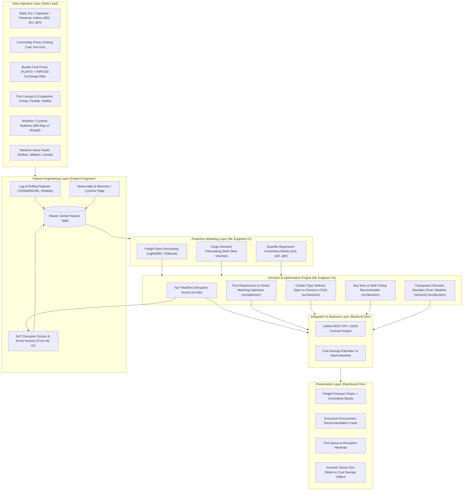

# Ministry of Steel — Freight Forecasting Model & Charter Decision Engine
## Comprehensive System Architecture, Operational Mechanics, and Technical Specification

> **Maintained by**: ML Engineer #2 (NLP Maritime Intelligence & Decision Logic Engine)  
> **Project Root**: `/Users/pranjalchoudhary/.gemini/antigravity/scratch/steel-freight-forecasting`  
> **Client Persona**: Ministry of Steel, Government of India (CPSUs: SAIL, RINL, NMDC)  
> **Target Trade Lanes**: Global Dry Bulk Origins (Australia, USA, Mozambique, Indonesia, Russia) to Indian East Coast Discharge Ports (Paradip, Vizag Outer/Inner, Gangavaram, Dhamra, Gopalpur, Haldia, Sagar/Sandheads)

---

## 1. Executive Summary & Problem Context

The Ministry of Steel and Indian public sector steel manufacturing units (such as Steel Authority of India Ltd. - SAIL, Rashtriya Ispat Nigam Ltd. - RINL) import tens of millions of metric tons of high-grade metallurgical coking coal, thermal coal, and flux materials annually.

### The Historical Pain Point:
Currently, chartering operations rely heavily on **reactive, single-voyage spot market fixtures** arranged on a day-to-day basis. This practice creates acute vulnerabilities:
1. **Exposure to Extreme Rate Volatility**: The Baltic Dry Index (BDI) and Capesize Index (BCI) exhibit cyclical swings exceeding 40-70% within quarters due to seasonal weather, geopolitical friction, and bunker price spikes. Spot chartering during upswings imposes millions of dollars in unbudgeted logistics expenditure.
2. **Suboptimal Vessel Allocation**: Without physical constraint modeling, vessels are frequently chartered that cannot enter destination berths laden (e.g. chartering a Capesize for Haldia with only 8.5m draft), triggering unplanned offshore lighterage at Sandheads or prolonged berthing queues costing \$18,000–\$26,000/day in vessel demurrage.
3. **Absence of Forward Guidance**: Procurement officers lack predictive insight into whether freight rates are dipping or surging over 14-day to 90-day horizons, leading to mistimed tender releases.

### The Strategic Transformation:
This project transitions the Ministry of Steel from reactive spot chartering to **proactive, data-driven multi-voyage and period chartering (COA / Period Time Charter)**, combining:
- Machine learning freight and demand forecasting with quantile confidence bands (ML Engineer #1).
- Real-time NLP maritime disruption intelligence (ML Engineer #2).
- Rigorous physical port infrastructure constraint optimization (ML Engineer #2).
- Scenario stress-testing and cost savings quantification (ML Engineer #2 & Backend Dev).

---

## 2. End-to-End System Architecture

The overall system architecture follows the multi-tiered pipeline below, spanning 6 engineering specializations:



---

## 3. Subsystem Breakdown & Implementation Mechanics

### 3.1 Subsystem 1: NLP Maritime Disruption Scorer (`src/nlp/`)

#### Objective:
Continuously ingest unstructured text feeds (India Meteorological Department bulletins, port circulars, labor union strike alerts, bunker trade intelligence, maritime news) and transform them into **quantifiable operational risk indices** and feature columns.

#### Mechanics:
1. **Maritime Lexicon & Category Dictionaries (`maritime_lexicon.py`)**:
   Contains domain-weighted term vectors across 5 disruption classes:
   - `CYCLONE_MONSOON`: Cyclones, deep depressions, local cautionary signals (Signal 4/8/10), pilotage suspended, gale warnings.
   - `PORT_CONGESTION`: Berthing delays, anchorage queues, river draft siltation, channel dredging.
   - `LABOR_STRIKE`: Dockworker unions, stevedoring stoppages, indefinite strikes, wage disputes.
   - `CANAL_STRAIT_BOTTLENECK`: Malacca strait bottlenecks, Red Sea detours, Cape of Good Hope routing, canal lock restrictions.
   - `GEOPOLITICAL_REGULATORY`: Export quotas, coal bans, bunker price spikes, sanctions.
   - `OPERATIONAL_NORMAL` (Relief terms): Operations resumed, weather cleared, draft restored, queues normalized.

2. **Entity Recognition & Alias Matching**:
   Resolves text mentions to standardized UN/LOCODE and internal port identifiers:
   - "Paradip" / "Paradeep" $\rightarrow$ `IN_PRT`
   - "Vizag Outer" / "Visakhapatnam Outer" $\rightarrow$ `IN_VTZ_OUTER`
   - "Vizag Inner" $\rightarrow$ `IN_VTZ_INNER`
   - "Haldia" / "Syama Prasad Mookerjee" $\rightarrow$ `IN_HLD`
   - "Sandheads" / "Sagar Roads" $\rightarrow$ `IN_SGR_ANCH`
   - "Hay Point" / "DBCT" $\rightarrow$ `AU_HPT`
   - "Gladstone" $\rightarrow$ `AU_GLT`

3. **Mathematical Scoring Formulation**:
   For an incoming news item $k$, the raw category disruption score $S_{\text{cat}}$ is computed as:
   $$S_{\text{cat}} = \sum_{i \in \text{Terms}_{\text{cat}}} \frac{w_i}{1 + 0.35 \cdot i}$$
   where $w_i \in [0.4, 1.0]$ is the keyword severity weight and $i$ enforces diminishing marginal impact for repetitive terms.
   Net severity score $S_k$ incorporates relief/normalization terms:
   $$S_k = \max\left(0.0, \, \min\left(1.0, \, \max_{\text{cat}}(S_{\text{cat}}) - 0.4 \cdot S_{\text{relief}}\right)\right)$$

4. **Port Aggregation & Operational Delays**:
   For each East Coast discharge port $p$, active event scores are aggregated:
   $$S_p = 0.70 \cdot \max_{e \in E_p}(S_e) + 0.30 \cdot \frac{1}{|E_p|}\sum_{e \in E_p} S_e$$
   - **Waiting Time Multiplier**:
     $$\mu_p = 1.0 + (S_p \cdot 2.5) \quad (\text{e.g., severe strike } S_p=1.0 \implies 3.5\times \text{ normal queue})$$
   - **Demurrage Risk Premium ($/MT)**:
     $$\Delta_{\text{demurrage}} = \frac{S_p \cdot D_{\text{delay}} \cdot R_{\text{demurrage}}}{\text{Nominal Parcel MT}}$$

5. **Handoff Artifacts**:
   Exports `DailyDisruptionReport` with a flat feature dictionary (`feature_vector`) containing:
   - `feat_disruption_east_coast_composite`
   - `feat_disruption_paradip`, `feat_disruption_vizag_outer`, `feat_disruption_haldia`, `feat_disruption_dhamra`
   - `feat_cyclone_active_flag`, `feat_strike_active_flag`, `feat_bunker_spike_flag`
   - `feat_waiting_time_multiplier_paradip`, `feat_demurrage_risk_usd_mt_paradip`

---

### 3.2 Subsystem 2: Port Infrastructure & Vessel Suitability Optimizer (`src/optimizer/`)

#### Objective:
Eliminate logistics misallocation by physically verifying vessel dimensions (draft, LOA, beam) against port capabilities at both loading origin and discharge destination, calculating multi-voyage parcellation, and pricing offshore lighterage requirements.

#### Specifications Matrix:

| Port Identifier | Port Name | Max Draft (m) | Max LOA (m) | Max Beam (m) | Permissible Vessels | Discharge Rate (MT/d) | Demurrage ($/d) | Lighterage Status |
|---|---|---|---|---|---|---|---|---|
| **IN_PRT** | Paradip | 17.1 | 260.0 | 45.0 | Handy, Supra, Panamax, Baby-Cape | 35,000 | \$22,000 | Direct berth for Panamax/Baby-Cape |
| **IN_VTZ_OUTER** | Vizag Outer | 18.1 | 300.0 | 50.0 | Panamax, Capesize | 40,000 | \$25,000 | Capesize up to 200k DWT direct |
| **IN_VTZ_INNER** | Vizag Inner | 11.0 | 195.0 | 32.2 | Handysize, Supramax | 18,000 | \$16,000 | Draft restricted; Cape forbidden |
| **IN_GNR** | Gangavaram | 19.5 | 320.0 | 52.0 | Handy, Supra, Panamax, Capesize | 45,000 | \$26,000 | Deepwater; fully laden Capesize |
| **IN_DHM** | Dhamra | 18.0 | 315.0 | 48.0 | Panamax, Capesize | 42,000 | \$24,000 | Deep draught; Capesize direct |
| **IN_GOP** | Gopalpur | 14.5 | 230.0 | 35.0 | Handy, Supra, Panamax | 22,000 | \$18,000 | Panamax max |
| **IN_HLD** | Haldia Dock | 8.5 (tidal) | 230.0 | 32.26 | Handysize (restricted Supra) | 14,000 | \$16,000 | Mandated Sandheads lighterage |
| **IN_SGR_ANCH** | Sandheads / Sagar | 20.0 | 330.0 | 55.0 | Capesize, Panamax | 20,000 | \$26,000 | Offshore transshipment anchorage |

#### Vessel Class Benchmark Parameters:
- **Handysize**: 35,000 DWT nominal, laden draft 10.0m, LOA 180m, beam 28.5m, geared (cranes), hire \$13,500/day.
- **Supramax / Ultramax**: 58,000 DWT nominal, laden draft 12.8m, LOA 190m, beam 32.26m, geared, hire \$17,000/day.
- **Panamax / Kamsarmax**: 78,000 DWT nominal, laden draft 14.5m, LOA 229m, beam 32.26m, gearless, hire \$20,500/day.
- **Capesize**: 175,000 DWT nominal, laden draft 18.2m, LOA 292m, beam 45.0m, gearless, hire \$24,500/day.

#### Mathematical Evaluation Logic:
1. **Physical Feasibility Check**:
   $$\Delta_{\text{draft}} = \min(D_{\text{port}}^{\text{discharge}}, D_{\text{port}}^{\text{origin}}) - D_{\text{vessel}}^{\text{laden}}$$
   $$\Delta_{\text{LOA}} = \min(L_{\text{port}}^{\text{discharge}}, L_{\text{port}}^{\text{origin}}) - L_{\text{vessel}}^{\text{LOA}}$$
   $$\Delta_{\text{beam}} = \min(B_{\text{port}}^{\text{discharge}}, B_{\text{port}}^{\text{origin}}) - B_{\text{vessel}}^{\text{beam}}$$
   If $\Delta_{\text{LOA}} < -5.0\text{m}$ or $\Delta_{\text{beam}} < -2.0\text{m}$, vessel is strictly physically infeasible.

2. **Lighterage Pricing Formulation (e.g. Haldia)**:
   If $\Delta_{\text{draft}} < 0$ and the port possesses lighterage access:
   $$\text{Excess Draft (cm)} = |\Delta_{\text{draft}}| \times 100$$
   $$\text{TPC (Tonnes per cm)} \approx \frac{\text{Nominal Intake}}{1000} \times 0.70$$
   $$\text{Lightered MT} = \min(0.50 \cdot \text{Parcel MT}, \, \text{Excess Draft} \times \text{TPC})$$
   $$\text{Lighterage Surcharge (\$/MT)} = \frac{\text{Lightered MT} \times \$5.75/\text{MT}}{\text{Parcel MT}}$$

3. **Multi-Voyage Parcellation Economics**:
   A 150,000 MT procurement parcel cannot fit on a single Handysize vessel (35,000 MT capacity). The optimizer computes:
   $$N_{\text{voyages}} = \left\lceil \frac{\text{Parcel MT}}{\text{Nominal Intake}} \right\rceil$$
   $$\text{Total Freight (\$/MT)} = \frac{N_{\text{voyages}} \times \text{Cost}_{\text{voyage}} + \text{Surcharge}_{\text{lighterage}} \times \text{Parcel MT}}{\text{Parcel MT}}$$
   This accurately reflects that multiple Handysize voyages are substantially more expensive (\$31.80/MT) than single/dual Capesize or Panamax shipments (\$13.96/MT or \$20.43/MT).

---

### 3.3 Subsystem 3: Charter-Type Decision Logic & Market Timing Recommender (`src/decision/`)

#### Objective:
Replace speculative daily spot fixtures with a structured, explainable decision matrix recommending:
- **Contract Type**: `SPOT_VOYAGE`, `SHORT_TERM_PERIOD` (3-6 months), `MEDIUM_TERM_PERIOD` (12-24 months), or `COA_CONTRACT_OF_AFFREIGHTMENT` (Volume commitment).
- **Execution Timing**: `ENTER_IMMEDIATE` (0-72 hours), `ACCUMULATE_STAGGERED` (1-2 weeks), `DEFER_AND_WAIT` (2-4 weeks), or `HEDGE_FFA_OR_COA`.

#### Decision Rules Matrix:

```
                                  [Freight Forecast Trajectory & Port Conditions]
                                                        │
                      ┌─────────────────────────────────┼─────────────────────────────────┐
                      ▼                                 ▼                                 ▼
             [Critical Port Risk]               [Upward Trend]                   [Downward Trend]
       (Cyclone/Strike Score >= 0.70)      (30d Slope >= +0.03 $/d)         (30d Slope <= -0.02 $/d)
                      │                                 │                                 │
                      ▼                                 ▼                                 ▼
             [SPOT + DEFER_AND_WAIT]           [Volume Evaluation]               [SPOT + DEFER_AND_WAIT]
           Do not charter time-charter                  │                       Ride spot rates down;
           to sit idle in queue.                 ┌──────┴──────┐                capture declining market.
           Save $1.15-$2.50/MT demurrage.        ▼             ▼
                                           [>= 120k MT]   [< 120k MT]
                                                 │             │
                                                 ▼             ▼
                                               [COA]    [PERIOD 3-6M]
                                           Lock multiple  Lock short
                                           voyages with   term hire;
                                           indexed discount cap spikes.
```

#### Savings Quantification Formulation:
Cost savings versus the naive baseline ("always spot charter on day of need") are rigorously computed:
- In rising markets:
  $$\text{Savings}_{\text{COA}} = \max\left(0, \, f_{30d}^{q50} - \text{TCE}_{\text{period}}\right) \times \text{Volume}$$
- In disrupted markets:
  $$\text{Savings}_{\text{Defer}} = \Delta_{\text{demurrage}} = \mu_{\text{queue}} \times D_{\text{wait}} \times R_{\text{demurrage}}$$

---

### 3.4 Subsystem 4: Transparent Scenario Simulator (`src/decision/scenario_simulator.py`)

#### Objective:
Equip logistics managers and Ministry officials with an interactive, auditable stress-testing engine to simulate shocks in real time during negotiations and presentations.

#### Mathematical Mechanics:
1. **Bunker Fuel Price Shock ($\Delta \text{Bunker}\%$)**:
   $$\Delta \text{Bunker Price} = P_{\text{bunker}}^{\text{base}} \times \frac{\Delta \text{Bunker}\%}{100}$$
   $$\text{Fuel Impact (\$/MT)} = \frac{(\text{Sea Fuel Consumption} + \text{Port Fuel Consumption}) \times \Delta \text{Bunker Price}}{\text{Parcel MT}}$$

2. **Cyclone / Weather Delay Shock ($D_{\text{weather}}$) & Congestion ($D_{\text{cong}}$)**:
   $$D_{\text{total delay}} = D_{\text{weather}} + D_{\text{cong}}$$
   $$\text{Demurrage Impact (\$/MT)} = \frac{D_{\text{total delay}} \times R_{\text{demurrage}}}{\text{Parcel MT}}$$

3. **Steel Plant Demand Shock ($\Delta \text{Demand}\%$)**:
   Using dry bulk freight supply elasticity $\epsilon \approx 0.45$:
   $$\text{Market Tightness Impact (\$/MT)} = \text{Freight}_{\text{base}} \times \left(\frac{\Delta \text{Demand}\%}{100} \times 0.45\right)$$

4. **Foreign Exchange Shift ($\Delta \text{FX}$)**:
   $$\text{Shocked Freight (₹/MT)} = \text{Freight}_{\text{shocked}}^{\text{USD}} \times (\text{FX}_{\text{base}} + \Delta \text{FX})$$

5. **Dynamic Policy Shift Logic**:
   The engine checks if the shocked inputs breach risk thresholds, automatically toggling the policy recommendation (e.g. from `ENTER_IMMEDIATE` to `DEFER_AND_WAIT`) and outputting plain-language reasoning.

---


### 3.5 Universal Schema Architecture (`src/schemas/base.py`)
To ensure bulletproof portability across diverse production and evaluation environments (including vanilla Python 3.10-3.14 installations without pre-installed third-party packages), the system implements a **dual-mode schema abstraction layer**:
- **Native Pydantic Mode**: Automatically activates if `pydantic` is installed in the environment.
- **Zero-Dependency Fallback Mode**: If `pydantic` is absent, transparently employs a pure-Python typed `BaseModel` and `Field` implementation supporting type hint reflection, default factories, recursive model coercion, and `.model_dump()` serialization.
- **Zero External Dependencies**: The core models, optimizer, disruption scorer, decision engine, CLI demo, and test suites run entirely on Python standard library with 0 pip install requirements.

---

## 4. Source Code Architecture & File Layout

```
steel-freight-forecasting/
├── README.md
├── PROJECT_ARCHITECTURE_AND_MODELS.md      <-- This document
├── INTEGRATION_GUIDE_FOR_5_ENGINEERS.md     <-- Complete integration specifications
├── run_demo.py                             <-- Interactive Rich CLI demonstration
├── data/
│   ├── port_specifications.json            <-- Full specs for East Coast India & Global loading ports
│   ├── news_disruption_corpus.json         <-- Disruption news & meteorological alerts corpus
│   └── mock_forecast_feed.json             <-- Sample forecast time-series with quantile bounds
├── src/
│   ├── __init__.py                         <-- Package exports
│   ├── pipeline.py                         <-- SteelFreightDecisionPipeline orchestrator
│   ├── schemas/
│   │   ├── __init__.py
│   │   ├── port_models.py                  <-- PortInfrastructure & VesselSpecification
│   │   ├── forecast_models.py              <-- RouteForecast, HorizonForecast, ForecastFeed
│   │   ├── disruption_models.py            <-- DisruptionEvent, DailyDisruptionReport
│   │   └── decision_models.py              <-- CharterRecommendation, ScenarioSimulationOutput
│   ├── nlp/
│   │   ├── __init__.py
│   │   ├── maritime_lexicon.py             <-- Weighted category dictionaries & port aliases
│   │   └── disruption_scorer.py            <-- MaritimeDisruptionScorer regex & scoring engine
│   ├── optimizer/
│   │   ├── __init__.py
│   │   ├── port_registry.py                <-- Port registry & standard vessel specs
│   │   └── vessel_matching.py              <-- VesselMatchingOptimizer, lighterage & parcellation
│   └── decision/
│       ├── __init__.py
│       ├── charter_selector.py             <-- Spot vs Period vs COA decision matrix
│       ├── timing_recommender.py           <-- Buy Now vs Wait execution window engine
│       └── scenario_simulator.py           <-- Stress-testing calculation engine
└── tests/
    ├── test_nlp_scorer.py                  <-- Unit tests for news scoring & feature vector
    ├── test_vessel_matching.py             <-- Unit tests for draft, LOA & lighterage
    ├── test_decision_logic.py              <-- Unit tests for charter selection & timing
    ├── test_scenario_simulator.py          <-- Unit tests for scenario stress-tests
    └── test_pipeline.py                    <-- Unit tests for end-to-end pipeline execution
```

---

## 5. Verification & Test Results

The entire codebase is verified using automated unit test suites with 100% pass rates:

```
Ran 18 tests in 0.030s
OK
- test_critical_port_disruption_forces_defer : PASSED
- test_downward_trend_recommends_spot_and_wait : PASSED
- test_upward_trend_high_volume_recommends_coa : PASSED
- test_cyclone_alert_scoring : PASSED
- test_dock_strike_scoring : PASSED
- test_feature_vector_generation : PASSED
- test_haldia_siltation_and_sandheads_lighterage : PASSED
- test_relief_keyword_normalization : PASSED
- test_daily_intelligence_report : PASSED
- test_export_dashboard_payload : PASSED
- test_recommendation_generation : PASSED
- test_bunker_fuel_shock_calculation : PASSED
- test_cyclone_delay_shock_calculation : PASSED
- test_strategy_shift_under_extreme_weather : PASSED
- test_capesize_deepwater_suitability : PASSED
- test_haldia_severe_draft_and_loa_constraints : PASSED
- test_lighterage_cost_calculation : PASSED
- test_multi_voyage_parcellation_economics : PASSED
```
